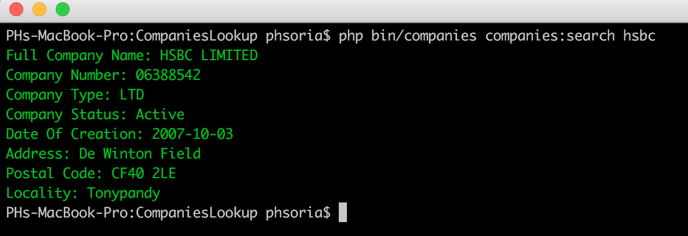

# CompaniesLookup

Simple and fast tool to find companies (from their *Company Number* or *Company Name*).

I realized there was no such console tools for finding a company from [Companies House](https://www.gov.uk/government/organisations/companies-house) database (similar to the *Unix whois command* for finding the domain names' details).




## Steup

* Be sure PHP 7.0 or higher is installed

* Install Composer (https://getcomposer.org)

* Then run:

```bash
$ composer install
```

* Rename `.env.example` to `.env`

```bash
$ mv .env.example .env
```

* Request your Companies House API key => https://developer.companieshouse.gov.uk/developer/applications

* Open the file (with your favourite text editor)

```bash
$ nano .env
```

* Add the Companies House API Key between the double quote `"` `"`

* Change the permissions of the `companies` bash file (if you use the bash shortcut file)

```bash
$ chmod u+x ./companies
```

* Run the script:

```bash
$ ./companies <COMPANY_NAME / COMPANY_ID>
```
OR
```bash
php bin/companies companies:search <COMPANY_NAME / COMPANY_ID>
```

#### Example to find HSBC company

With the Company Name:

```bash
$ ./companies HSBC
```

Or with the Company ID:

```bash
$ ./companies 06388542
```

* Enjoy!


## Requirements

* PHP 7.0 or higher
* [Composer](https://getcomposer.org)
* [Companies House API key](https://developer.companieshouse.gov.uk/developer/signin)


## About me

I'm **Pierre-Henry Soria**, Software Engineer (love that!) and also passionate about marketing and e-businesses.


## Where to contact me?

You can by email at **pierrehenrysoria+github [[AT]] gmail [[D0T]] com**


## License

Under [General Public License 3](http://www.gnu.org/licenses/gpl.html) or later.
